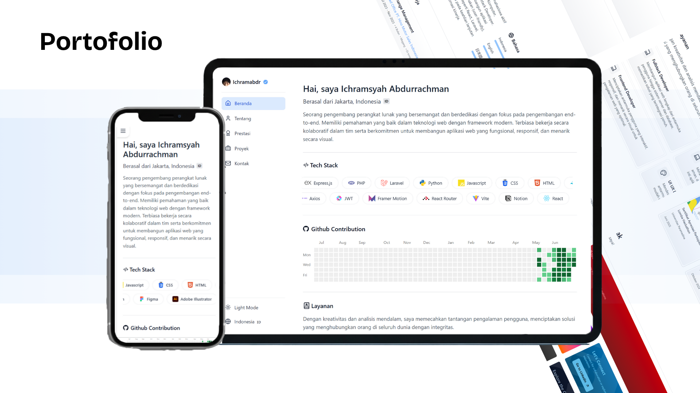

# Portfolio Website - Dashboard Style

[](LICENSE)
[](https://github.com/ichramsyah/portfolio-dashboard-style/actions)
[](https://reactjs.org/)
[](https://tailwindcss.com/)
[](https://www.framer.com/motion/)
[](https://greensock.com/gsap/)
[](https://lucide.dev/)
[](https://vitejs.dev/)
[](https://github.com/ichramsyah/portfolio-dashboard-style)

[](https://react.dev/)
[](https://vitejs.dev/)
[](https://tailwindcss.com/)
[](https://www.framer.com/motion/)
[](https://greensock.com/gsap/)

[README.md](README.markdown) Versi Indonesia.

Welcome to the **Portfolio Dashboard Style** project! 🚀 This is a modern personal portfolio website built with a dashboard layout, designed to showcase projects, achievements, and personal information. Powered by React, Vite, Tailwind CSS, Framer Motion, GSAP, and Lucide React icons, this project offers an interactive and responsive experience.

## Table of Contents

- [Introduction](#introduction)
- [Features](#features)
- [Technologies Used](#technologies-used)
- [Requirements](#requirements)
- [Installation](#installation)
- [Usage](#usage)
- [Configuration](#configuration)
- [Testing](#testing)
- [Deployment](#deployment)
- [Contributing](#contributing)
- [License](#license)
- [Contact](#contact)

## Introduction

The **Portfolio Dashboard Style** is a dynamic and visually appealing personal website that presents a dashboard-style interface for showcasing projects, achievements, and personal details. Inspired by modern design trends, this project emphasizes performance, responsiveness, and clean code practices using cutting-edge web technologies.

## Features

- **Modern Dashboard Layout**: Clean, modular sections including Home, About, Achievements, Projects, and Contact.
- **Responsive Design**: Fully optimized for mobile, tablet, and desktop devices using Tailwind CSS.
- **Interactive Animations**: Smooth transitions and animations with Framer Motion and GSAP for enhanced user engagement.
- **Theme & Language Support**: Dark mode and multi-language support (English and Bahasa Indonesia) via custom React contexts.
- **Component-Based Architecture**: Maintainable code with reusable React components.
- **Customizable**: Easily modify sections, animations, and styles due to its modular design.

## Technologies Used

- **Frontend**: React 19.1.0, Vite 6.3.5
- **Styling**: Tailwind CSS 4.1.10
- **Animations**: Framer Motion 12.19.2, GSAP 3.13.0
- **Icons**: Lucide React
- **State Management**: React Context API
- **Local Storage**: Custom hook for theme and language persistence

## Requirements

Before starting, ensure the following are installed:

- **Node.js**: Version 22.14.0
- **Package Manager**: NPM (recommended) or Yarn
- **Modern Browser**: Chrome, Firefox, Edge, or Safari (latest versions)
- **IDE/Text Editor**: VS Code, Sublime Text, or similar

## Installation

Get the project running locally with these steps:

1. **Clone the Repository**:

   ```bash
   git clone https://github.com/ichramsyah/portfolio-dashboard-style.git
   cd portfolio-dashboard-style
   ```

2. **Install Dependencies**:

   - Using NPM:
     ```bash
     npm install
     ```
   - Using Yarn:
     ```bash
     yarn install
     ```

3. **Run the Development Server**:
   - Using NPM:
     ```bash
     npm run dev
     ```
   - Using Yarn:
     ```bash
     yarn dev
     ```
     The app will be available at [http://localhost:3000](http://localhost:3000) (or the port specified by Vite).

## Usage

After installation, open your browser to the development URL to explore the portfolio dashboard. The development server supports hot reloading for instant feedback on code changes.

For a production build:

```bash
npm run build
```

Preview the build:

```bash
npm run preview
```

## Configuration

- **Theme & Language**:  
  Adjust theme and language settings in `src/contexts/ThemeContext.jsx` and `src/contexts/LanguageContext.jsx`. Modify the `translations` object in `src/data/translations.js` to add or update languages.

- **Tailwind CSS**:  
  Customize styles in `tailwind.config.js` and update CSS classes in components as needed.

- **Project Data**:  
  Edit project details in `src/components/sections/projects/projectsData.js` to update titles, descriptions, and links.

## Testing

To ensure code quality, run the following (if tests are added):

```bash
npm test
```

_(Note: Add test scripts and files like `src/__tests__/` if you plan to include testing with Jest or React Testing Library.)_

## Deployment

Deploy the project to a hosting service:

- **Netlify**: Drag the `dist` folder (after `npm run build`) or connect your GitHub repository.
- **Vercel**: Run `vercel` after installing the Vercel CLI, or deploy via the Vercel dashboard.
- **GitHub Pages**: Use `gh-pages` package:
  ```bash
  npm install gh-pages --save-dev
  npm run deploy
  ```
  Update `homepage` in `package.json` to your GitHub Pages URL.

## Contributing

Contributions are encouraged! Follow these steps:

1. **Fork the Repository**: Create your own copy.
2. **Create a Branch**: Use a descriptive name (e.g., `feature/animation-enhancement`).
3. **Make Changes**: Commit with clear messages (`git commit -m "Add animation enhancement"`).
4. **Push Changes**: `git push origin feature/animation-enhancement`.
5. **Submit a Pull Request**: Provide a detailed description of your changes.
6. **Report Issues**: Open an issue for bugs or feature requests.

Please adhere to the project's code style and include documentation for new features.

## License

This project is licensed under the [GNU General Public License v3.0 (GPL-3.0)](LICENSE.txt). You are free to use, modify, and distribute this software, provided you comply with the GPL-3.0 terms. See the [LICENSE](LICENSE.txt) file for details.

## Contact

- **Author**: Ichramsyah
- **Email**: ichramsyahabdurrachman@gmail.com
